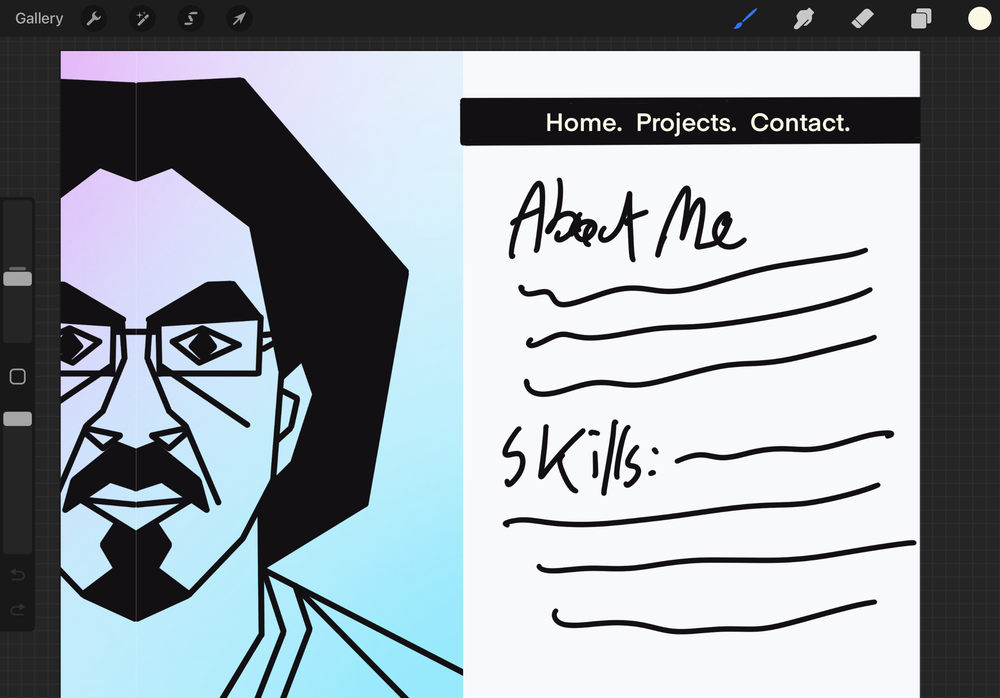
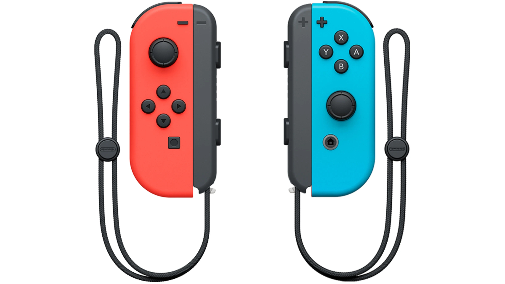

# Portfolio Page Design Process
My Portfolio Website: [jatipat.github.io](https://jatipat.github.io)

There were three main steps to designing my personal website: (1) Research what makes a personal website cool (3) Find your own style, and (2) Develop the website based on that style.

## Research Process
Researching other cool pages was really easy. I recommend looking up “Portfolio Page Review” on Youtube to get an eye for page design.

I figured out my website should be:
* Minimalistic - Easy to use with 3 main sections (About Me, Projects, Contact Info)
* Clean to read - legible fonts that feels professional and unique (Poppins from Google Fonts)
* Leave a good impression - Make something that can hook the audience

### First Prototype in Procreate

*  Findings: 50/50 formatting is good, but black background with white text would mesh well and will cause less eye strain.

### Joycons for Color Reference

* Color choice of hot pink and neon blue came from Joycon controllers and works well. Three main sections is a good way to keep things minimalistic, so it’s time to make it!

## Development Process
* Easy to split sections with flexboxes
* HTML holds all of the info and web links
* CSS is doing a majority of the styling (flexboxes, link colors, formatting text)
* JavaScript was only used to switch between tabs

## Issues During Development
1. Aligning and formatting content/text in perfect spots
* Solution: Create smaller divs to separate text into columns, etc.

2. Website looks horrible on phones and tablets!
* Solution: Use @mediascreens to set up specific font sizes, content, layout, etc. And get rid of the image on the phone, it takes too much space

3.  It’s okay, but still not hooking me in!
* Solution: Change the design by making the left image friendlier and more movement. Add a gradient with keyframes to make the image more dynamic. Change your name with a different font style (Great Vibes from Google fonts. Add a slight delay in pressing the tab and showing in information to make it more seamless.

## Conclusion
I created a personal portfolio using three main steps: research what’s cool out there, find my own style, and implement it. By making all the content modular on the HTML page dark while using CSS to add more vibrant colors and movement, this portfolio illustrates my professionalism and personality. 

